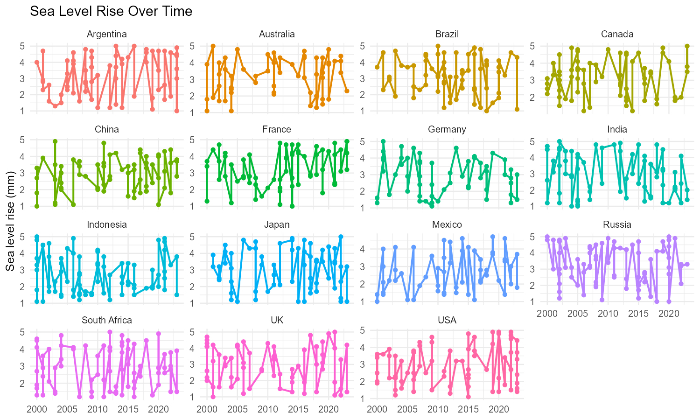
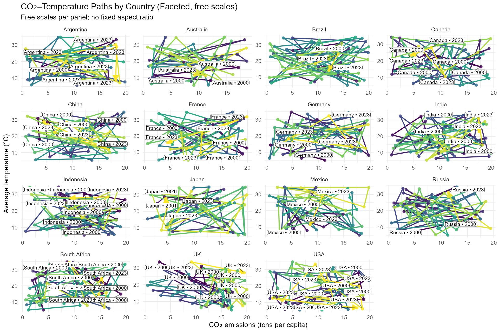
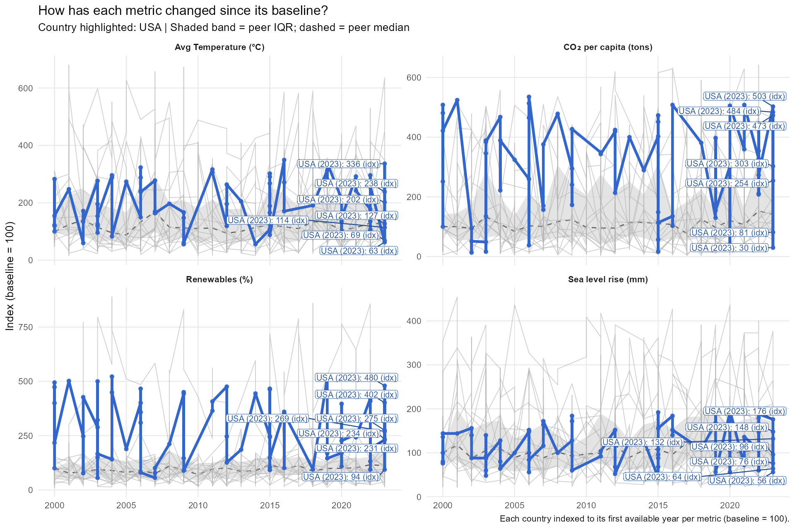
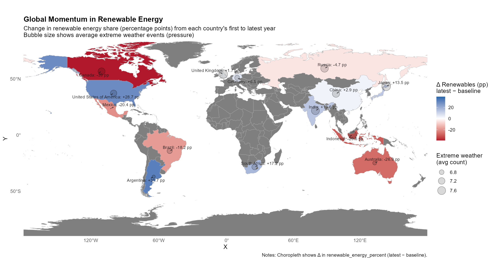
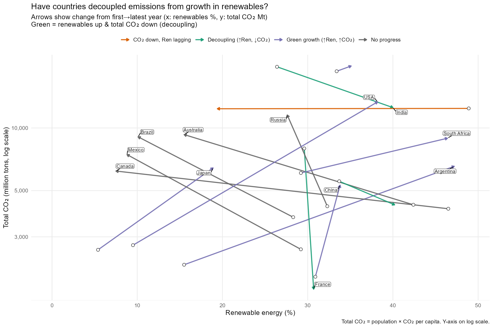

# 🚀 Analytics Portfolio
Welcome! Explore three end‑to‑end data projects demonstrating **EDA, modeling, inference, and visualization** in R (plus a bit of reproducible workflow).

> Tip: Each project page includes a short narrative, visuals, and links to downloadable tables/figures.

---

## 📂 Projects

### 1) [Climate Data](/climate-data/)
Understand environmental signals and trade‑offs:
- Indexed change story (baseline = 100)
- CO₂ ↔️ Temperature connected paths (per country, over time)
- Sea‑level trends, ridgelines, eco‑tradeoff map
- Global renewable momentum (static + animated)

**Tech:** R · tidyverse · ggplot2 · ggridges · ggrepel · sf · rnaturalearth · gganimate

---

### 2) [E‑commerce Data](/ecommerce-data/)
Customer, product, and revenue analytics:
- Cohort retention & RFM segmentation
- A/B uplift views for experiments
- Basket affinity (market basket) and price‑mix visuals

**Tech:** R · dplyr · ggplot2 · arules · broom

> *(Placeholder page)* — add your dataset, visuals, and write‑ups here.

---

### 3) [Housing](/housing/)
Market structure & valuation signals:
- Hedonic regression (price drivers)
- Spatial trends and neighborhood profiling
- Time‑on‑market & affordability dashboards

**Tech:** R · tidymodels · sf · ggplot2 · yardstick

> *(Placeholder page)* — add your dataset, visuals, and write‑ups here.

---

## 🖼️ Featured Visuals (from Climate)
- 
- 
- 
- 
- 
- 
- 
- 

---

---

## ✉️ Contact
- Email: kimutaialex2@gmail.com
- LinkedIn · GitHub 

> *Everything here is evolving—check back for new analyses and dashboards.*

